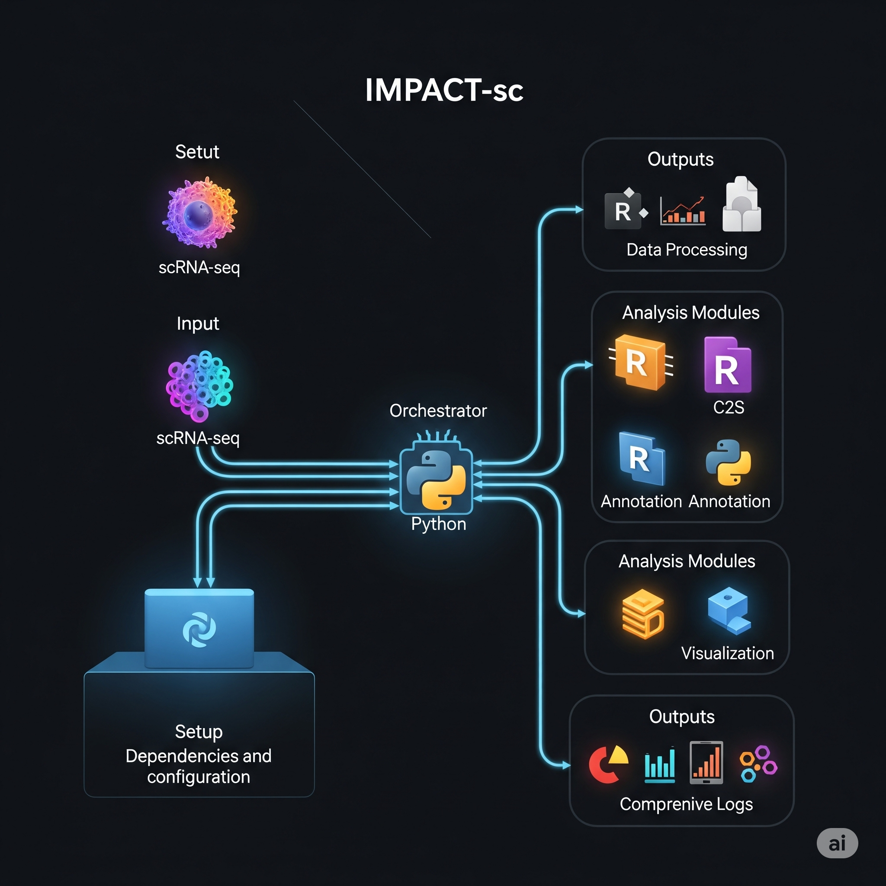

# IMPACT-sc: Integrated Multi-Pipeline Analysis and Characterization of Single-Cell Data

<p align="center">
  
</p>

**IMPACT-sc** is a modular pipeline for comprehensive single-cell RNA sequencing (scRNA-seq) data analysis, integrating R and Python scripts for everything from data processing to advanced downstream analyses.

---

## 🚀 Quick Start

### Complete Installation Workflow

1. **Install Dependencies**:
   ```bash
   git clone https://github.com/schoo7/impact_sc.git
   cd impact_sc
   ./install_dependencies.sh  # Installs R, Python, and all required packages
   ```

2. **Download Data**:
   ```bash
   ./download_data.sh  # Downloads demo data, models, and reference datasets (~3-5GB)
   ```

3. **Run Demo** (Recommended for first-time users):
   ```bash
   ./run_demo.sh  # Automatically configures and runs demo with PBMC3k data
   ```
   
   **OR Configure Manually**:
   ```bash
   conda activate impact_sc
   python interactive_setup.py  # Choose demo or custom mode
   python run_impact_sc_pipeline.py [path_to_params.json]
   ```

---

## 🎯 Demo Mode vs Custom Mode

### **🎯 Demo Mode** (Recommended for beginners)
- **One-click setup**: Pre-configured parameters for PBMC3k dataset
- **Automatic data detection**: Uses downloaded demo data, models, and references
- **Quick testing**: Runs core modules (data processing, C2S, annotation, visualization)
- **No user input required**: All paths and parameters automatically set

**Demo includes**:
- PBMC3k dataset (3,000 cells from 10x Genomics)
- Cell2Sentence model for cell type prediction
- HumanPrimaryCellAtlas reference data
- Optimized gene markers for immune cell visualization

### **⚙️ Custom Mode** (For experienced users)
- **Flexible configuration**: Use your own datasets and parameters  
- **Smart defaults**: Downloaded data used as suggestions when available
- **Full control**: Select specific modules and customize all parameters
- **Data validation**: Checks file existence and provides helpful warnings

---

## 💡 Smart Data Integration

The interactive setup now automatically:

1. **Detects Downloaded Data**:
   - ✅ Demo data at `data/demo/`
   - ✅ Cached AI models at `data/models/`  
   - ✅ Reference data at `data/reference/`

2. **Provides Intelligent Defaults**:
   - Uses cached Cell2Sentence model (no re-download)
   - Suggests downloaded reference data for SingleR
   - Auto-configures paths based on available data

3. **Validates Data Availability**:
   - Warns when required files are missing
   - Provides fallback to online resources when possible
   - Clear error messages for troubleshooting

---

## 📥 Data Download System

The `download_data.sh` script provides automated downloading of all required data:

### **1. Demo Data**
- **Source**: 10x Genomics PBMC3k dataset
- **Format**: Filtered gene-barcode matrices (HDF5)
- **Size**: ~1.8MB (compressed), ~19MB (uncompressed)
- **Path**: `data/demo/filtered_gene_bc_matrices/`

### **2. AI Models**
- **Model**: `vandijklab/C2S-Pythia-410m-cell-type-prediction`
- **Framework**: PyTorch (via HuggingFace Transformers)
- **Size**: ~1.5GB
- **Path**: `data/models/`

### **3. Reference Data**
- **Dataset**: `HumanPrimaryCellAtlasData` from celldex
- **Format**: RDS (R data object)
- **Size**: ~1.2GB
- **Path**: `data/reference/HumanPrimaryCellAtlasData.rds`

### **Features**:
- ✅ Automatic resume for interrupted downloads
- ✅ Disk space verification (requires 5GB minimum)
- ✅ Cross-platform support (wget/curl fallback)
- ✅ Comprehensive logging (`download_data.log`)

---

## 🔍 Verification Script

The `test_data_download.py` script checks:
1. **Download Tools**: wget, curl, tar
2. **Model Access**: Transformers library and model availability
3. **R Packages**: celldex and other required packages

Run verification:
```bash
python test_data_download.py
```

---

## 📁 Updated Project Structure

```
impact_sc/
├── data/                      # Downloaded data (auto-created)
│   ├── demo/                 # PBMC3k demo dataset
│   ├── models/               # Pre-trained AI models
│   └── reference/            # Reference datasets
├── download_data.sh          # Data download script
├── test_data_download.py     # Data verification script
└── ...
```

---

## 📋 Overview

IMPACT-sc consists of three main components:
1. **Dependency Installation** - Set up R and Python environments
2. **Interactive Configuration** - Generate analysis parameters  
3. **Pipeline Execution** - Run selected analysis modules

### Key Features:
- **Data Processing**: QC, filtering, normalization
- **Batch Correction**: Harmony integration  
- **Cell Type Annotation**: Seurat, SingleR, Cell2Sentence
- **Visualization**: UMAP, tSNE, feature plots
- **Differential Expression**: DGE and GSEA analysis
- **Pathway Analysis**: DecoupleR, PROGENy, UCell
- **Advanced Analysis**: Pseudotime, query projection

<p align="center">
  
  <br/>
  <em>Figure: Overview of the IMPACT-sc pipeline workflow</em>
</p>

**Supported:** Human & Mouse | Windows & macOS (including Apple Silicon) | R + Python integration

---

## 🛠️ Installation Guide

### Step 1: Prerequisites

<details>
<summary><strong>🪟 Windows Prerequisites</strong></summary>

#### **1.1 Install Git Bash**
- Download from: https://git-scm.com/download/win
- **IMPORTANT**: Run Git Bash as Administrator for installations

#### **1.2 Install R and Rtools**
1. **Install R** from: https://cran.r-project.org/bin/windows/base/
2. **Install Rtools** (CRITICAL): https://cran.r-project.org/bin/windows/Rtools/
   - Choose version matching your R (e.g., Rtools43 for R 4.3.x)
   - **Check "Add to PATH" during installation**

#### **1.3 Install Conda**
- **Miniconda** (recommended): https://docs.conda.io/en/latest/miniconda.html#windows-installers
- Choose "Miniconda3 Windows 64-bit"

#### **1.4 Windows Locale Settings (IMPORTANT)**
1. Control Panel > Region > Administrative tab
2. Under 'Language for non-Unicode programs', click 'Change system locale...'
3. Ensure **'Beta: Use Unicode UTF-8' is UNCHECKED**
4. Set locale to **'English (United States)'**
5. **RESTART your computer** (required for R packages)

**Verify Installation:**
```bash
# In Git Bash
Rscript --version
make --version  # Should work if Rtools installed correctly
conda --version
```
</details>

<details>
<summary><strong>🍎 macOS Prerequisites</strong></summary>

#### **1.1 Install Xcode Command Line Tools**
```bash
xcode-select --install
```

#### **1.2 Install Homebrew**
```bash
/bin/bash -c "$(curl -fsSL https://raw.githubusercontent.com/Homebrew/install/HEAD/install.sh)"
```

#### **1.3 Install R**
```bash
# Option A: Homebrew (recommended)
brew install r

# Option B: Download from https://cran.r-project.org/bin/macosx/
```

#### **1.4 Install Build Tools**
```bash
brew install cmake pkg-config gfortran

# For Apple Silicon only
brew install llvm libomp
```

#### **1.5 Install Conda**
- **Miniconda**: https://docs.conda.io/en/latest/miniconda.html#macos-installers
- **Apple Silicon**: Choose `Miniconda3 macOS Apple M1 64-bit pkg`
- **Intel**: Choose `Miniconda3 macOS Intel x86 64-bit pkg`

**Verify Installation:**
```bash
Rscript --version
gcc --version
conda --version
```
</details>

<details>
<summary><strong>🐧 Linux Prerequisites</strong></summary>

#### **1.1 Install R**
```bash
# Ubuntu/Debian
sudo apt update
sudo apt install -y r-base r-base-dev

# CentOS/RHEL/Fedora
sudo yum install -y R R-devel  # or dnf install

# Arch Linux
sudo pacman -S r

# Or install from CRAN for latest version:
# https://cran.r-project.org/bin/linux/
```

#### **1.2 Install System Dependencies**
The installation script will handle this automatically, but you can install manually:

```bash
# Ubuntu/Debian
sudo apt install -y build-essential libcurl4-openssl-dev libssl-dev \
    libxml2-dev libfontconfig1-dev libharfbuzz-dev libfribidi-dev \
    libfreetype6-dev libpng-dev libtiff5-dev libjpeg-dev cmake pkg-config gfortran

# CentOS/RHEL/Fedora
sudo yum groupinstall -y "Development Tools"
sudo yum install -y libcurl-devel openssl-devel libxml2-devel \
    fontconfig-devel harfbuzz-devel fribidi-devel freetype-devel \
    libpng-devel libtiff-devel libjpeg-turbo-devel cmake pkgconfig gcc-gfortran

# Arch Linux
sudo pacman -S base-devel curl openssl libxml2 fontconfig \
    harfbuzz fribidi freetype2 libpng libtiff libjpeg-turbo cmake pkgconfig gcc-fortran
```

#### **1.3 Install Conda**
```bash
# Download Miniconda
wget https://repo.anaconda.com/miniconda/Miniconda3-latest-Linux-x86_64.sh
bash Miniconda3-latest-Linux-x86_64.sh

# Follow installation prompts and restart terminal
```

**Verify Installation:**
```bash
Rscript --version
gcc --version
conda --version
```
</details>

#### **Optional: Ollama AI Enhancement**
```bash
# Download from: https://ollama.ai/download
ollama --version
ollama pull gemma2:9b  # Install recommended model
```

---

### Step 2: Platform-Specific Package Installation

<details>
<summary><strong>🪟 Windows R Package Installation</strong></summary>

1. **Open Git Bash as Administrator** (Right-click > "Run as administrator")
2. **Navigate to project directory:**
   ```bash
   cd /path/to/impact_sc
   ```
3. **Run Windows R installer:**
   ```bash
   bash install_r_packages_windows.sh
   ```

**What this installs:**
- Bioconductor packages (SingleR, Seurat, etc.)
- CRAN packages (ggplot2, dplyr, etc.)  
- GitHub packages (SeuratExtend, CARD, etc.)

**Time:** 30-60 minutes | **Log:** `r_package_install_windows.log`
</details>

<details>
<summary><strong>🍎 macOS R Package Installation</strong></summary>

```bash
# Navigate to project directory
cd /path/to/impact_sc

# Run macOS R installer
chmod +x install_r_packages_mac.sh
./install_r_packages_mac.sh
```

**What this installs:**
- Platform-optimized compilation for Apple Silicon
- Bioconductor packages (SingleR, Seurat, etc.)
- CRAN packages (ggplot2, dplyr, etc.)  
- GitHub packages (SeuratExtend, CARD, etc.)

**Time:** 30-60 minutes (longer on Apple Silicon) | **Log:** `r_package_install_mac.log`
</details>

---

### Step 3: Python Environment Setup

**All Platforms:**
```bash
# Create and set up Python environment
bash setup_python_environment.sh
```

**What this does:**
- Creates `impact_sc` conda environment with Python 3.9
- Installs scientific packages (pandas, numpy, scanpy, etc.)
- Installs specialized packages (cell2sentence, transformers)

**Time:** 15-30 minutes | **Log:** `python_env_setup.log`

---

### Step 4: Verification

**Test R Installation:**
```bash
Rscript -e "
library(Seurat)
library(SingleR) 
library(ggplot2)
cat('✅ R packages loaded successfully!\n')
cat('Seurat version:', as.character(packageVersion('Seurat')), '\n')
"
```

**Test Python Environment:**
```bash
conda activate impact_sc
python -c "
import pandas as pd
import scanpy as sc
import cell2sentence
print('✅ All Python packages installed successfully!')
print(f'Scanpy version: {sc.__version__}')
"
```

---

## 🔧 Configuration and Usage

### Step 1: Interactive Setup

```bash
# Activate environment
conda activate impact_sc

# Run interactive setup
python interactive_setup.py
```

**Configuration includes:**

<details>
<summary><strong>Platform-Specific Path Examples</strong></summary>

**🪟 Windows Paths:**
```bash
R executable: "C:\Program Files\R\R-4.3.0\bin\x64\Rscript.exe"
Scripts: "C:\path\to\impact_sc\scripts_AI"
Output: "C:\Users\YourName\Documents\impact_output"
```

**🍎 macOS Paths:**
```bash
# Apple Silicon
R executable: "/opt/homebrew/bin/Rscript"
# Intel Mac  
R executable: "/usr/local/bin/Rscript"
# CRAN R (both)
R executable: "/Library/Frameworks/R.framework/Resources/bin/Rscript"

Scripts: "/Users/yourusername/impact_sc/scripts_AI"
Output: "/Users/yourusername/impact_sc/output"
```
</details>

### Step 2: Run Pipeline

```bash
python run_impact_sc_pipeline.py /path/to/impact_sc_params.json
```

---

## 📊 Available Analysis Modules

| Module | Description | Requirements |
|--------|-------------|--------------|
| **01_data_processing** | QC, filtering, normalization | Raw scRNA-seq data |
| **02a_harmony_c2s_prep** | Batch correction prep | Processed data |
| **02b_c2s** | Cell2Sentence analysis | H5AD file, C2S model |
| **02c_load_c2s_result** | Load C2S results | C2S output |
| **03_cell_type_annotation** | Cell type annotation | SingleR reference |
| **04a_basic_visualization** | UMAP, tSNE, plots | Processed data |
| **04b_DE_gsea** | Differential expression | Annotated data |
| **04c_decoupler** | Pathway analysis | CollecTRI/PROGENy files |
| **04d_ucell_scores** | Gene signatures | MSigDB data |
| **04e_pseudotime** | Trajectory analysis | Start cell barcode |
| **04f_query_projection** | Query mapping | Query RDS file |

---

## 🐛 Troubleshooting

<details>
<summary><strong>🪟 Windows-Specific Issues</strong></summary>

| Problem | Solution |
|---------|----------|
| **Permission denied** | Run Git Bash as Administrator |
| **R packages won't compile** | Install/reinstall Rtools, check PATH |
| **Conda not found** | Add conda to PATH, restart terminal |
| **Locale errors** | Set locale to English (US), restart computer |
| **Make command not found** | Install Rtools with PATH option checked |

**Debugging:**
```bash
# Check R and Rtools
Rscript -e "Sys.which('make')"  # Should show path

# Check environment
conda info --envs  # Should show impact_sc
```

**Key Requirements:**
- ✅ Administrator privileges for Git Bash
- ✅ Rtools installed with PATH
- ✅ English (US) locale settings
- ✅ Computer restarted after locale change
</details>

<details>
<summary><strong>🍎 macOS-Specific Issues</strong></summary>

| Problem | Solution |
|---------|----------|
| **R packages won't compile** | Install Xcode CLI: `xcode-select --install` |
| **Permission errors** | Fix R library permissions |
| **Conda not found** | Add conda to PATH in `~/.zshrc` |
| **Build tool errors** | `brew install cmake gfortran` |
| **Apple Silicon issues** | Try Rosetta mode: `arch -x86_64 R` |

**Apple Silicon Environment Variables:**
```bash
# Add to ~/.zshrc if needed
export LDFLAGS="-L/opt/homebrew/lib"
export CPPFLAGS="-I/opt/homebrew/include"
export PKG_CONFIG_PATH="/opt/homebrew/lib/pkgconfig"
```

**Debugging:**
```bash
# Check architecture
uname -m  # arm64 = Apple Silicon, x86_64 = Intel

# Check R paths
which Rscript
R --slave -e ".libPaths()"

# Check build tools
xcode-select -p  # Should show Xcode path
```

**Key Requirements:**
- ✅ Xcode Command Line Tools installed
- ✅ Homebrew installed and working  
- ✅ R accessible via command line
- ✅ Conda environment properly activated
</details>

<details>
<summary><strong>🐧 Linux-Specific Issues</strong></summary>

| Problem | Solution |
|---------|----------|
| **R packages won't compile** | Install build tools: `sudo apt install build-essential` (Ubuntu) |
| **Missing system libraries** | Install development headers: `sudo apt install lib*-dev` |
| **Permission errors** | Use `sudo` for system package installation |
| **Conda not found** | Add conda to PATH in `~/.bashrc` or `~/.zshrc` |
| **Old R version** | Install from CRAN repository for latest version |
| **Package manager fails** | Try different package manager (apt/yum/dnf/pacman) |

**Environment Variables:**
```bash
# Add to ~/.bashrc or ~/.zshrc if needed
export PKG_CONFIG_PATH="/usr/lib/pkgconfig:/usr/lib/x86_64-linux-gnu/pkgconfig"
export LD_LIBRARY_PATH="/usr/lib:/usr/local/lib"
```

**Debugging:**
```bash
# Check distribution
cat /etc/os-release

# Check R installation
which Rscript
R --slave -e ".libPaths()"

# Check build tools
gcc --version
make --version
pkg-config --version

# Check system libraries
ldconfig -p | grep -E "(curl|ssl|xml)"
```

**Key Requirements:**
- ✅ Build tools installed (gcc, make, cmake)
- ✅ Development libraries installed
- ✅ R accessible via command line
- ✅ Conda environment properly activated
- ✅ Sudo privileges for system package installation
</details>

### **Common Log Files:**
- `r_package_install_windows.log` / `r_package_install_mac.log` - R package installation
- `python_env_setup.log` - Python environment setup  
- `*_log.txt` in output directory - Individual module logs

---

## 📁 Project Structure

```
impact_sc/
├── README.md                      # This comprehensive guide
├── scripts_AI/                    # Analysis modules
├── install_r_packages_windows.sh  # Windows R installer
├── install_r_packages_mac.sh      # macOS R installer  
├── setup_python_environment.sh    # Python environment setup
├── install_dependencies.sh        # Unified cross-platform installer
├── download_data.sh               # Data download script
├── environment.yml                # Conda environment specification
├── interactive_setup.py           # Configuration script
├── run_impact_sc_pipeline.py     # Main pipeline
├── data/                          # Downloaded data (created by download_data.sh)
│   ├── demo/                     # Demo datasets (PBMC3k)
│   ├── models/                   # Pre-trained models (Cell2Sentence)
│   └── reference/                # Reference data (HumanPrimaryCellAtlas)
└── output/                        # Results (created during setup)
    ├── impact_sc_params.json     # Configuration file
    ├── *_log.txt                 # Module logs
    └── results/                   # Analysis outputs
```

---

## 🔬 Technical Details

### **System Requirements:**
- **R** (≥4.2) + Bioconductor packages
- **Python** (3.9) + scientific stack  
- **System tools** (build tools, conda)

### **Supported Features:**
- ✅ **Species**: Human and Mouse
- ✅ **Platforms**: Windows, macOS (Intel/Apple Silicon), and Linux (Ubuntu/Debian/CentOS/RHEL/Fedora/Arch)
- ✅ **Environments**: Conda virtual environments
- ✅ **Integration**: R + Python seamless workflow
- ✅ **Reproducibility**: JSON parameter configuration
- ✅ **Modularity**: Select only needed analysis steps

### **Performance Notes:**
- **Installation time**: 1-2 hours total
- **R packages**: 30-60 minutes
- **Python environment**: 15-30 minutes  
- **Pipeline execution**: Varies by data size and modules

---

## 🆘 Getting Help

1. **Check platform-specific troubleshooting sections above**
2. **Review log files** for detailed error messages
3. **Verify prerequisites** are properly installed
4. **Test each step individually** using verification commands

### **Cross-Platform Notes:**
- JSON parameter files work on both platforms
- Module functionality is identical across platforms
- File paths use platform-appropriate separators

---

## 📄 Citation

If you use IMPACT-sc in your research, please cite:

```
[Citation information to be added]
```

## 🤝 Contributing

Contributions welcome! Please ensure compatibility with both Windows and macOS platforms.

---

**⚡ Total setup time: ~1-2 hours | Get started by expanding your platform section above!** 

### Unified Installation (All Platforms)

1. **Clone the repository**:
   ```bash
   git clone https://github.com/schoo7/impact_sc.git
   cd impact_sc
   ```

2. **Run the unified installer**:
   ```bash
   chmod +x install_dependencies.sh
   ./install_dependencies.sh
   ```
   This will:
   - Detect your OS and architecture (Windows, macOS, Linux)
   - Install required system dependencies automatically
   - Install required R packages with proper Bioconductor version matching (including celldex)
   - Set up a Python conda environment with all dependencies

3. **Download demo data and models**:
   ```bash
   chmod +x download_data.sh
   ./download_data.sh
   ```
   This will download (~3-5GB):
   - **Demo data**: PBMC3k dataset from 10x Genomics
   - **AI Models**: Cell2Sentence pre-trained model
   - **Reference data**: HumanPrimaryCellAtlasData for cell type annotation

4. **Verify installation**:
   ```bash
   # Test R installation
   Rscript -e "library(Seurat); library(SingleR); library(celldex); cat('✅ R packages installed successfully!\n')"
   
   # Test Python environment
   conda activate impact_sc
   python -c "import scanpy, torch; print(f'✅ Scanpy {scanpy.__version__}, PyTorch {torch.__version__}')"
   
   # Check data availability
   ls -la data/
   ```

---

## 🔧 Configuration

After installation, configure the pipeline:
```bash
conda activate impact_sc
python interactive_setup.py
```

Then run the pipeline:
```bash
python run_impact_sc_pipeline.py /path/to/impact_sc_params.json
```

---

## Key Improvements

- **Cross-platform support**: Works on Windows, macOS (Intel/Apple Silicon), and Linux (Ubuntu/Debian/CentOS/RHEL/Fedora/Arch)
- **Automatic version management**:
  - Detects R version and installs compatible Bioconductor
  - Handles Python package compatibility
- **Automated system dependencies**: Installs build tools and libraries automatically
- **Isolated environments**:
  - R packages installed system-wide
  - Python packages in dedicated conda environment

For troubleshooting, see the updated [Troubleshooting section](#-troubleshooting) below. 