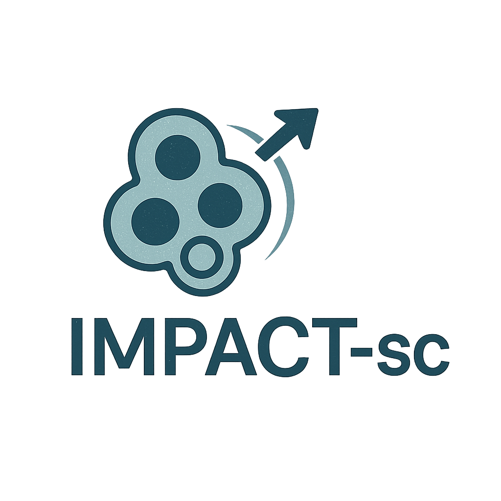

# IMPACT-sc: Integrated Multi-Pipeline Analysis and Characterization of Single-Cell Data

<p align="center">
  
</p>

**IMPACT-sc** is a modular pipeline for comprehensive single-cell RNA sequencing (scRNA-seq) data analysis, integrating R and Python scripts for everything from data processing to advanced downstream analyses.

---

## ⏬Complete Installation Workflow

🪟 Windows & 🍎 macOS 
（We strongly recommend completing the Installation Guide before using）
1.  **Clone Repository and Install Dependencies**:
    ```bash
    git clone https://github.com/schoo7/impact_sc.git
    cd impact_sc
    chmod +x install_dependencies.sh # For mac and linux users
    ./install_dependencies.sh  #  Input your R bin path
    ```

2.  **Activate Environment and Download Data**:
    ```bash
    conda activate impact_sc # Activates the Conda environment
    chmod +x download_data.sh # For mac and linux users
    ./download_data.sh  # Downloads demo data, models, and reference datasets (~3-5GB)
    ```

3.  **Configure and Run Pipeline**:
    ```bash
    python interactive_setup.py  # Recommended demo for first-time users
    python run_impact_sc_pipeline.py [path_to_params.json] # Runs the pipeline with the generated parameters file
    ```

---

## 🛠️ Installation Guide

### Step 1: Prerequisites

<details>
<summary><strong>🪟 Windows Prerequisites</strong></summary>

#### **1.1 Install Git Bash**
- Download from: https://git-scm.com/download/win
- **IMPORTANT**: Run Git Bash as Administrator for installations

#### **1.2 Install R and Rtools**
1. **Install R (Recommended: R 4.2.3)** from: https://cran.r-project.org/bin/windows/base/old/
2. **Install Rtools** (CRITICAL): https://cran.r-project.org/bin/windows/Rtools/
   - Choose version matching your R (e.g., Rtools42 for R 4.2.x)
   - **Check "Add to PATH" during installation**

#### **1.3 Install Conda**
- **Miniconda** (recommended): https://docs.conda.io/en/latest/miniconda.html#windows-installers
- Choose "Miniconda3 Windows 64-bit"

#### **1.4 Windows Locale Settings (IMPORTANT)**
1. Control Panel > Region > Administrative tab
2. Under 'Language for non-Unicode programs', click 'Change system locale...'
3. Ensure **'Beta: Use Unicode UTF-8' is UNCHECKED**
4. Set locale to **'English (United States)'**
5. **RESTART your computer** (required for R packages)

**Verify Installation:**
```bash
# In Git Bash
Rscript --version
make --version  # Should work if Rtools installed correctly
conda --version
```
</details>

<details>
<summary><strong>🍎 macOS Prerequisites</strong></summary>

#### **1.1 Install Xcode Command Line Tools**
```bash
xcode-select --install
```

#### **1.2 Install Homebrew**
```bash
/bin/bash -c "$(curl -fsSL [https://raw.githubusercontent.com/Homebrew/install/HEAD/install.sh](https://raw.githubusercontent.com/Homebrew/install/HEAD/install.sh))"
```

#### **1.3 Install R**

**Install R (Recommended: R 4.2.3)** from: https://cran.r-project.org/bin/macosx/big-sur-arm64/base/

#### **1.4 Install Build Tools**
```bash
brew install gcc libxml2 libgit2 udunits harfbuzz fribidi freetype pkg-config cmake openssl@3 openjdk gdal proj geos imagemagick@6

# For Apple Silicon only
brew install llvm libomp

export PKG_CONFIG_PATH=/opt/homebrew/opt/imagemagick@6/lib/pkgconfig
```

#### **1.5 Install Conda**
- **Miniconda**: https://docs.conda.io/en/latest/miniconda.html#macos-installers
- **Apple Silicon**: Choose `Miniconda3 macOS Apple M1 64-bit pkg`
- **Intel**: Choose `Miniconda3 macOS Intel x86 64-bit pkg`

**Verify Installation:**
```bash
Rscript --version
gcc --version
conda --version
```
</details>

<details>
<summary><strong>🐧 Linux Prerequisites</strong></summary>

#### **1.1 Install R**
```bash
# Ubuntu/Debian
sudo apt update
sudo apt install -y r-base r-base-dev

# CentOS/RHEL/Fedora
sudo yum install -y R R-devel  # or dnf install

# Arch Linux
sudo pacman -S r

# Or install from CRAN for latest version:
# [https://cran.r-project.org/bin/linux/](https://cran.r-project.org/bin/linux/)
```

#### **1.2 Install System Dependencies**
The installation script will handle this automatically, but you can install manually:
```bash
# Ubuntu/Debian
sudo apt install -y build-essential libcurl4-openssl-dev libssl-dev \
    libxml2-dev libfontconfig1-dev libharfbuzz-dev libfribidi-dev \
    libfreetype6-dev libpng-dev libtiff5-dev libjpeg-dev cmake pkg-config gfortran

# CentOS/RHEL/Fedora
sudo yum groupinstall -y "Development Tools"
sudo yum install -y libcurl-devel openssl-devel libxml2-devel \
    fontconfig-devel harfbuzz-devel fribidi-devel freetype-devel \
    libpng-devel libtiff-devel libjpeg-turbo-devel cmake pkgconfig gcc-gfortran

# Arch Linux
sudo pacman -S base-devel curl openssl libxml2 fontconfig \
    harfbuzz fribidi freetype2 libpng libtiff libjpeg-turbo cmake pkgconfig gcc-fortran
```

#### **1.3 Install Conda**
```bash
# Download Miniconda
wget [https://repo.anaconda.com/miniconda/Miniconda3-latest-Linux-x86_64.sh](https://repo.anaconda.com/miniconda/Miniconda3-latest-Linux-x86_64.sh)
bash Miniconda3-latest-Linux-x86_64.sh

# Follow installation prompts and restart terminal
```

**Verify Installation:**
```bash
Rscript --version
gcc --version
conda --version
```
</details>


### Step 2: Download Ollama

**Install Ollama** from: https://ollama.com

**Choose your Ollama model:**
```bash
ollama run llama3.1
```

### Step 3: Verification

After running the main installation script (`install_dependencies.sh` or the platform-specific version), you can verify that the core components are installed correctly.

**Test R Installation:**
```bash
Rscript -e 'library(Seurat); library(CARD) cat("✅ R installed successfully!\n")'
```

**Test Python Environment:**
```bash
conda activate impact_sc
python -c "
import scanpy as sc
import cell2sentence
print('✅ Python installed successfully!')
print(f'Scanpy version: {sc.__version__}')
"
```

**Test Model Installation:**
```bash
conda activate impact_sc
python -c "
from transformers import pipeline
print('Attempting to load the model...')
pipe = pipeline('text-generation', model='vandijklab/C2S-Pythia-410m-cell-type-prediction')
print('✅ Model loaded successfully!')
"
```

---

## 🎯 Mode Selection

### **🎯 Demo Mode** (Recommended for beginners)

* **One-click setup**: Pre-configured parameters for PBMC3k dataset
* **Automatic data detection**: Uses downloaded demo data, models, and references
* **Quick testing**: Runs core modules (data processing, cell annotation, visualization)
* **No user input required**: All paths and parameters automatically set

**Demo includes**:
* PBMC3k dataset (3,000 cells from 10x Genomics)
* Automated cell type clustering 
* Optimized gene markers for immune cell visualization

### **⚙️ Custom Mode** (For experienced users)

* **Flexible configuration**: Use your own datasets and parameters
* **Smart defaults**: Downloaded data used as suggestions when available
* **Full control**: Select specific modules and customize all parameters
* **Data validation**: Checks file existence and provides helpful warnings

### **🤖 AI Mode** (AI-assisted analysis with minimal effort)

* **Natural language input**: Describe your data in natural language 
* **AI-guided parameter setup**: Automatically configures steps and model selection
* **Explainable suggestions**: Provides transparent rationale for selection
* **Interactive refinement**: Confirm whether satisfied with the configuration

---

## 💡 Smart Interactive Setup

1. **Detects Downloaded Data**:
   * Demo data at `data/demo/`
   * Cached AI models at `data/models/`
   * Reference data at `data/reference/`

2. **Provides Intelligent Defaults**:
   * Auto-configures paths 
   * Standard default setup
   * Automated data discovery
  
3. **Includes Diverse options available**:
   * Flexible cell type annotation strategies
   * User-driven tool selection
   * Fine-grained control within tools

4. **Validates Data Availability**:
   * Warns when required files are missing
   * Provides fallback to online resources when possible
   * Clear error messages for troubleshooting

---

## 📥 Data Download System

The `download_data.sh` script provides automated downloading of all required data:

### **1. Demo Data**
* **Source**: 10x Genomics PBMC3k dataset
* **Format**: Filtered gene-barcode matrices (HDF5)
* **Size**: ~1.8MB (compressed), ~19MB (uncompressed)
* **Path**: `data/demo/filtered_gene_bc_matrices/`

### **2. AI Models**
* **Model**: `vandijklab/C2S-Pythia-410m-cell-type-prediction`
* **Framework**: PyTorch (via HuggingFace Transformers)
* **Size**: ~1.5GB
* **Path**: `data/models/`

### **3. Reference Data**
* **Dataset**: `bmcite_demo` data
* **Format**: RDS (R data object)
* **Size**: ~200MB
* **Path**: `data/reference/bmcite_demo.rds`

### **Features**:
* ✅ Automatic resume for interrupted downloads
* ✅ Disk space verification (requires 2GB minimum)
* ✅ Cross-platform support (wget/curl fallback)
* ✅ Comprehensive logging (`download_data.log`)

## 📋 Overview
IMPACT-sc consists of three main components:
1. **Dependency Installation** - Set up R and Python environments
2. **Interactive Configuration** - Generate analysis parameters
3. **Pipeline Execution** - Run selected analysis modules

### Key Features:
* **Data Processing**: QC, filtering, normalization
* **Batch Correction**: Harmony integration
* **Cell Type Annotation**: Seurat, SingleR, Cell2Sentence
* **Visualization**: UMAP, tSNE, feature plots
* **Differential Expression**: DGE and GSEA analysis
* **Pathway Analysis**: DecoupleR, PROGENy, UCell
* **Advanced Analysis**: Pseudotime, query projection

**Supported:** Human & Mouse | Windows & macOS (including Apple Silicon) | R + Python integration

---

## 🔧 Configuration and Usage

### Step 1: Interactive Setup
The `interactive_setup.py` script guides you through creating a `impact_sc_params.json` configuration file. This file stores all the parameters for your analysis run.

```bash
# Activate the conda environment first
conda activate impact_sc

# Run the interactive setup script
python interactive_setup.py
```

### Step 2: Demo Input
```text
--- Welcome to IMPACT-sc Interactive Setup ---
...
Choose setup mode:
  [demo]   - Use pre-downloaded demo data for a quick test.
  [custom] - Manually configure all parameters.
  [ai]     - (New!) Describe your project to get help with configuration.
 (default: demo): custom

--- Rscript Executable Path ---
Enter the full path to your Rscript executable (e.g., .../R-4.3.1/bin/Rscript) (suggested: /opt/homebrew/bin/Rscript): <Enter>
Rscript executable path set to: /opt/homebrew/bin/Rscript

--- Script Locations ---
Enter the full path to the directory containing R and Python module scripts (suggested: /path/to/impact_sc/scripts_AI): <Enter>
Using suggested path: /path/to/impact_sc/scripts_AI

--- Input Data ---
Tip: Demo data available at: /path/to/impact_sc/data/demo/filtered_gene_bc_matrices/hg19
Enter the full path to your primary input scRNA-seq data file(s) (e.g., feature-barcode matrix directory...): /path/to/my_data/filtered_feature_bc_matrix

Do you want to add another path? (yes/no) (default: no): no

Enter the species ('human' or 'mouse') (default: human): human

--- Output Configuration ---
Enter the full path for your desired output/results folder (default: demo_output): output/my_pbmc_analysis

--- Module Selection ---
Available IMPACT-sc Modules:
  1: 01_data_processing
  2a: 02a_harmony_c2s_prep
  ...
Enter the keys of modules to run, separated by commas (e.g., 1,2a,2b,2c,3,4a): 1,3,4a,4b

--- Cell Type Annotation Method (Module 03) ---
Choose annotation source for the final 'cell_type' column(seurat, c2s, singler, cellama) (default: auto): singler

--- SingleR Reference Configuration (Module 03) ---
Tip: A downloaded reference is available at: /path/to/impact_sc/data/reference/bmcite_demo.rds
Enter the full path to your local SingleR reference RDS file for human: /path/to/my_references/HumanPrimaryCellAtlasData.rds
Enter the name of the metadata column in your reference file that contains cell type labels (default: label.main): celltype.l1

--- Basic Visualization (Module 04a) Specific Inputs ---
Enter comma-separated genes for FeaturePlot. Leave empty to skip.: CD3D,CD14,MS4A1,NKG7

Do you want to add a gene group for DotPlot? (yes/no) (default: yes): yes
Enter the name for this gene group (e.g., B_cell_markers): T_cell_markers
Enter comma-separated genes for 'T_cell_markers' (e.g., MS4A1,CD79A): CD3D,CD3E,CD8A
Group 'T_cell_markers' with genes ['CD3D', 'CD3E', 'CD8A'] added.
Do you want to add another gene group for DotPlot? (yes/no) (default: yes): no

...
Parameters saved to: output/my_pbmc_analysis/impact_sc_params.json

--- Setup Complete ---
Next steps:
1. Ensure all R and Python dependencies have been correctly installed.
2. Activate the 'impact_sc' conda environment: conda activate impact_sc
3. Run the pipeline using: python run_impact_sc_pipeline.py output/my_pbmc_analysis/impact_sc_params.json

```


### Step 3: Run Pipeline

Once the `impact_sc_params.json` file is generated, you can start the pipeline:

```bash
python run_impact_sc_pipeline.py /path/to/output/impact_sc_params.json
```
This will execute the modules you selected in the order you specified.

---

## 📊 Available Analysis Modules

| Module | Description | Requirements |
|--------|-------------|--------------|
| **01_data_processing** | QC, filtering, normalization | Raw scRNA-seq data |
| **02a_harmony_c2s_prep** | Batch correction prep | Processed data |
| **02b_c2s** | Cell2Sentence analysis | H5AD file, C2S model |
| **02c_load_c2s_result** | Load C2S results | C2S output |
| **03_cell_type_annotation** | Cell type annotation | reference & model |
| **04a_basic_visualization** | UMAP, tSNE, plots | Processed data |
| **04b_DE_gsea** | Differential expression | Annotated data |
| **04c_decoupler** | Pathway analysis | Annotated data |
| **04d_ucell_scores** | Gene signatures | MSigDB data |
| **04e_pseudotime** | Trajectory analysis | Start cell barcode |
| **04f_query_projection** | Query mapping | Query RDS file |
| **04g_card** | Spatial data annotation | Spatial RDS file |
| **04h_cell_chat** | Cellchat predicting | Annotated data |

---

## 🐛 Troubleshooting

<details>
<summary><strong>🪟 Windows-Specific Issues</strong></summary>

| Problem | Solution |
|---------|----------|
| **Permission denied** | Run Git Bash as Administrator |
| **R packages won't compile** | Install/reinstall Rtools, check PATH |
| **Conda not found** | Add conda to PATH, restart terminal |
| **Locale errors** | Set locale to English (US), restart computer |
| **Make command not found** | Install Rtools with PATH option checked |

**Debugging:**
```bash
# Check R and Rtools
Rscript -e "Sys.which('make')"  # Should show path

# Check environment
conda info --envs  # Should show impact_sc
```

**Key Requirements:**
- ✅ Administrator privileges for Git Bash
- ✅ Rtools installed with PATH
- ✅ English (US) locale settings
- ✅ Computer restarted after locale change
</details>

<details>
<summary><strong>🍎 macOS-Specific Issues</strong></summary>

| Problem | Solution |
|---------|----------|
| **R packages won't compile** | Install Xcode CLI: `xcode-select --install` |
| **Permission errors** | Fix R library permissions |
| **Conda not found** | Add conda to PATH in `~/.zshrc` |
| **Build tool errors** | `brew install cmake gfortran` |
| **Apple Silicon issues** | Try Rosetta mode: `arch -x86_64 R` |

**Apple Silicon Environment Variables:**
```bash
# Add to ~/.zshrc if needed
export LDFLAGS="-L/opt/homebrew/lib"
export CPPFLAGS="-I/opt/homebrew/include"
export PKG_CONFIG_PATH="/opt/homebrew/lib/pkgconfig"
```

**Debugging:**
```bash
# Check architecture
uname -m  # arm64 = Apple Silicon, x86_64 = Intel

# Check R paths
which Rscript
R --slave -e ".libPaths()"

# Check build tools
xcode-select -p  # Should show Xcode path
```

**Key Requirements:**
- ✅ Xcode Command Line Tools installed
- ✅ Homebrew installed and working  
- ✅ R accessible via command line
- ✅ Conda environment properly activated
</details>

<details>
<summary><strong>🐧 Linux-Specific Issues</strong></summary>

| Problem | Solution |
|---------|----------|
| **R packages won't compile** | Install build tools: `sudo apt install build-essential` (Ubuntu) |
| **Missing system libraries** | Install development headers: `sudo apt install lib*-dev` |
| **Permission errors** | Use `sudo` for system package installation |
| **Conda not found** | Add conda to PATH in `~/.bashrc` or `~/.zshrc` |
| **Old R version** | Install from CRAN repository for latest version |
| **Package manager fails** | Try different package manager (apt/yum/dnf/pacman) |

**Environment Variables:**
```bash
# Add to ~/.bashrc or ~/.zshrc if needed
export PKG_CONFIG_PATH="/usr/lib/pkgconfig:/usr/lib/x86_64-linux-gnu/pkgconfig"
export LD_LIBRARY_PATH="/usr/lib:/usr/local/lib"
```

**Debugging:**
```bash
# Check distribution
cat /etc/os-release

# Check R installation
which Rscript
R --slave -e ".libPaths()"

# Check build tools
gcc --version
make --version
pkg-config --version

# Check system libraries
ldconfig -p | grep -E "(curl|ssl|xml)"
```

**Key Requirements:**
- ✅ Build tools installed (gcc, make, cmake)
- ✅ Development libraries installed
- ✅ R accessible via command line
- ✅ Conda environment properly activated
- ✅ Sudo privileges for system package installation
</details>

### **Common Log Files:**
- `r_package_install_system_r_only.log` - R package installation
- `python_env_setup.log` - Python environment setup  
- `*_log.txt` in output directory - Individual module logs

---

## 📁 Project Structure

```
impact_sc/
├── README.md                      # This comprehensive guide
├── scripts_AI/                    # Analysis modules
├── install_dependencies.sh        # Unified cross-platform installer
├── download_data.sh               # Data download script
├── environment.yml                # Conda environment specification
├── interactive_setup.py           # Configuration script
├── run_impact_sc_pipeline.py     # Main pipeline
├── data/                          # Downloaded data (created by download_data.sh)
│   ├── demo/                     # Demo datasets (PBMC3k)
│   ├── models/                   # Pre-trained models (Cell2Sentence)
│   └── reference/                # Reference data (HumanPrimaryCellAtlas)
└── output/                        # Results (created during setup)
    ├── impact_sc_params.json     # Configuration file
    ├── *_log.txt                 # Module logs
    └── results                   # Analysis outputs
```

---

## 🔬 Technical Details

### **System Requirements:**
- **R** (≥4.2) + Bioconductor packages
- **Python** (3.9) + scientific stack  
- **System tools** (build tools, conda)

### **Supported Features:**
- ✅ **Species**: Human and Mouse
- ✅ **Platforms**: Windows, macOS (Intel/Apple Silicon), and Linux (Ubuntu/Debian/CentOS/RHEL/Fedora/Arch)
- ✅ **Environments**: Conda virtual environments
- ✅ **Integration**: R + Python seamless workflow
- ✅ **Reproducibility**: JSON parameter configuration
- ✅ **Modularity**: Select only needed analysis steps

### **Performance Notes:**
- **Installation time**: 1-2 hours total
- **R packages**: 30-60 minutes
- **Python environment**: 15-30 minutes  
- **Pipeline execution**: Varies by data size and modules

---

## 🆘 Getting Help

1. **Check platform-specific troubleshooting sections above**
2. **Review log files** for detailed error messages
3. **Verify prerequisites** are properly installed
4. **Test each step individually** using verification commands

### **Cross-Platform Notes:**
- JSON parameter files work on both platforms
- Module functionality is identical across platforms
- File paths use platform-appropriate separators

---

## 📄 Citation

If you use IMPACT-sc in your research, please cite:

```
[Citation information to be added]
```

## 🤝 Contributing

We welcome contributions to the IMPACT-sc project. If you have suggestions for improvements, please open an issue or submit a pull request on our GitHub repository. We appreciate your input and collaboration!

---

**⚡ Total setup time: ~1-2 hours | Get started by expanding your platform section above!**
